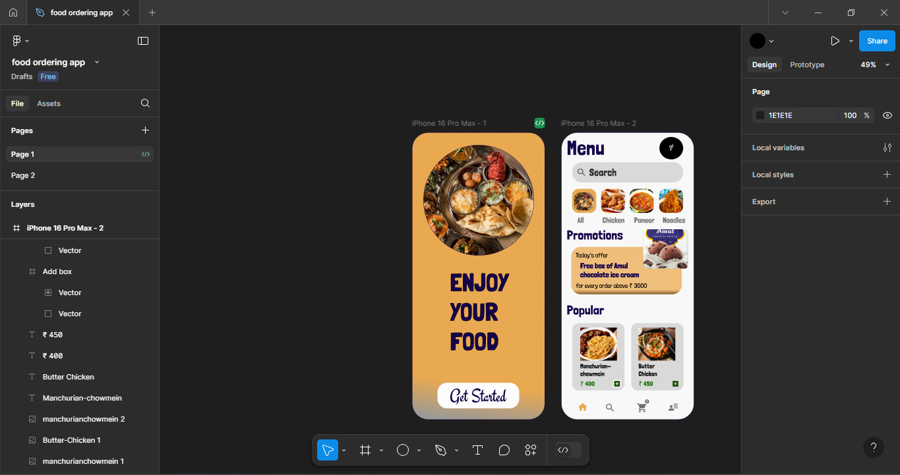
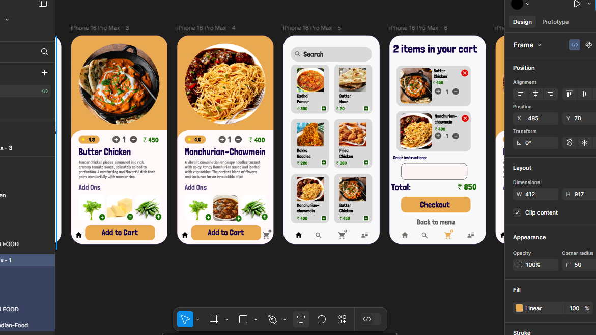

<h1>Food ordering app using Figma</h1>
<h5>This is a UI/UX assignment  given by InternPe where I had to develop a food ordering app, so i used Figma. I learned all concepts of figma and added
my creativity and learnings to it</h5>

CHECK OUT MY WORK:
<a href="https://www.figma.com/design/ZzjNSzeLvi2d8AVLPfinO3/food-ordering-app?node-id=1-2&t=em3CtR2JPU9rSRVO-1">Figma Project link</a>
<h3>Video:</h3>

https://github.com/user-attachments/assets/69279042-ec55-43d0-9f20-5fde9a723238

<h3>Here are some of the screenshots:</h3>

<h4>Thank you for checking this out! Hope you guys liked it</h4>

